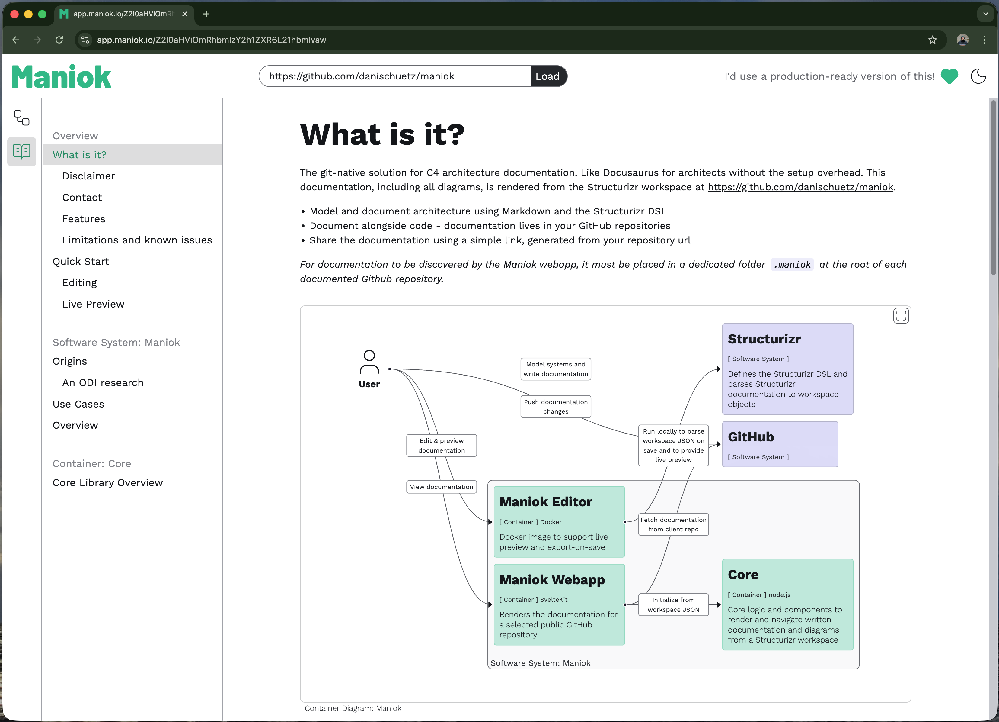

# Maniok

The git-native solution for C4 architecture documentation - like Docusaurus for architects, with C4 diagrams-as-code but without the setup overhead.

Maniok is an interactive webapp to inspect git-hosted Structurizr documentation. It renders C4 diagrams embedded in written documentation (Markdown) to create comprehensive technical documentation which can be easily maintained.

For an example, check out the [Maniok documentation](https://app.maniok.io/gh/danischuetz/maniok)!



Maniok is strcutured as a SvelteKit webapp built around a Node + Svelte core package at `packages/maniok-core`.

Have a look at the [public project](https://github.com/users/danischuetz/projects/3) for an overview on features planned and in progress.

## Getting Started

1. Run the [Maniok Architecture Prompt](https://github.com/danischuetz/maniok/blob/main/examples/maniok-architecture-prompt.md) in your repository to generate a C4 model from your codebase
    - Or create a [Structurizr](https://docs.structurizr.com/dsl) workspace yourself and put it in a `.maniok` folder at the root of your repository (**the workspace must be named workspace.dsl**)
2. Pull & run the Maniok-Preview Docker image, replacing `PATH` with the path to the created .maniok folder
    ```
    docker pull ghcr.io/danischuetz/maniok/maniok-preview:latest
    docker tag ghcr.io/danischuetz/maniok/maniok-preview maniok-preview
    docker run -t --rm -p 8080:8080 -v PATH:/usr/workspace maniok-preview:latest
    ```
3. Open the URL http://localhost:8080 in your browser and start editing. Maniok-Preview automatically exports your workspace and supports hot-reload! 🚀
4. Optional: Publish the changes, view and share the documentation via [https://app.maniok.io](https://app.maniok.io) (public repositories only atm)

## Current State & Restrictions

The project is at a very early stage (Proof-of-concept) and has a limited feature set. That is about to change but currently:

- It does currently work on **open source repositories only**
- Diagram layout doesn't work well in all cases and for uni-directional flows only
- On [https://app.maniok.io](https://app.maniok.io), the branch on viewed repositories is currently fixed to "HEAD"

# MVP

Work on that milestone is in progress, [have a look](https://github.com/users/danischuetz/projects/3/views/2).

The goal of this MVP is to enable the use of Maniok in a professional context.

# Structurizr Support

## Model

| Feature                            | Supported |
| ---------------------------------- | --------- |
| `person`                           | ✅        |
| `softwareSystem`                   | ✅        |
| `container`                        | ✅        |
| `component`                        | ✅        |
| `archetypes`                       | ✅        |
| `group`                            | ❌        |
| `deploymentEnvironment`            | ❌        |
| `deploymentGroup`                  | ❌        |
| `deploymentNode`                   | ❌        |
| `infrastructureNode`               | ❌        |
| `softwareSystemInstance`           | ❌        |
| `containerInstance`                | ❌        |
| `instanceOf`                       | ❌        |
| `description`                      | ✅        |
| `technology`                       | ✅        |
| `instances`                        | ❌        |
| `perspectives`                     | ❌        |
| `!identifiers`                     | ✅        |
| `!impliedRelationships`            | ✅        |
| `!include`                         | ✅        |
| `!docs`                            | ✅        |
| `!adrs`                            | ❌        |
| `!element` / `!elements`           | ✅        |
| `!relationship` / `!relationships` | ✅        |

## Views

| Feature                               | Supported |
| ------------------------------------- | --------- |
| `systemLandscape` view                | ❌        |
| `systemContext` view                  | ✅        |
| `container` view                      | ✅        |
| `component` view                      | ✅        |
| `filtered` view                       | ✅        |
| `dynamic` view                        | ❌        |
| `deployment` view                     | ❌        |
| `custom` view                         | ❌        |
| `image` view                          | ❌        |
| `include` / `exclude` (elements)      | ✅        |
| `include` / `exclude` (relationships) | ✅        |
| `autoLayout`                          | ✅        |
| `default`                             | ❌        |
| `animation`                           | ❌        |
| `title`                               | ❌        |

## Styles & Themes

At least currently, it is not the plan to support custom styling. This is an opinionated decision to focus on providing good styling automatically. Support for Maniok (CSS) themes other than already supported dark & bright modes might be added in the future but those will not be related to Structurizr Themes.

# Editing & Dev Setup

To run locally, clone the repository and run:

```bash
npm i
npm run dev
```

Maniok should then be available on localhost:5173 supporting hot-reload for any source file changes.

To run Maniok on a local workspace in the filesystem, use 'local' as the repository URL. By default, 'local' points to the maniok documentation. This path can be changed editing the `.env.example` file and renaming it to `.env`.

# How to contribute

As we are just getting started with this community, most welcome contributions would be to create and participate in discussions around how to collaborate, new features and the current roadmap.

This will soon be extended, once first bug reports and feature requests are coming in. Then we need to add:

- Bug Issue Template
- PR Template
